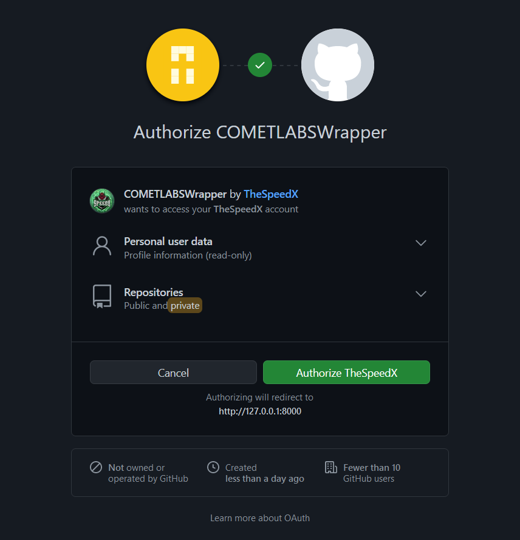
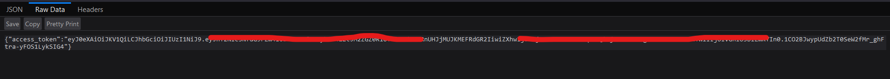
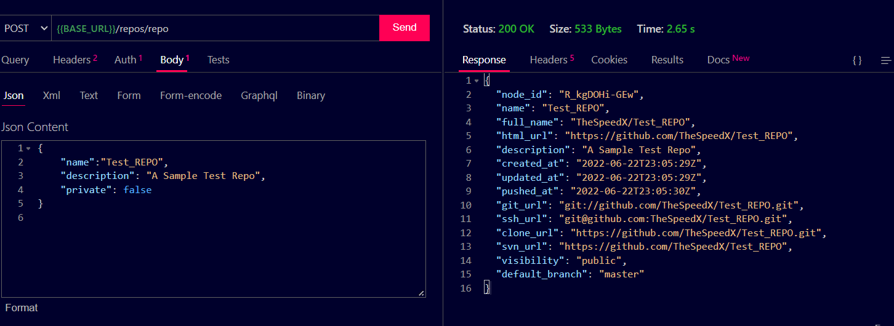
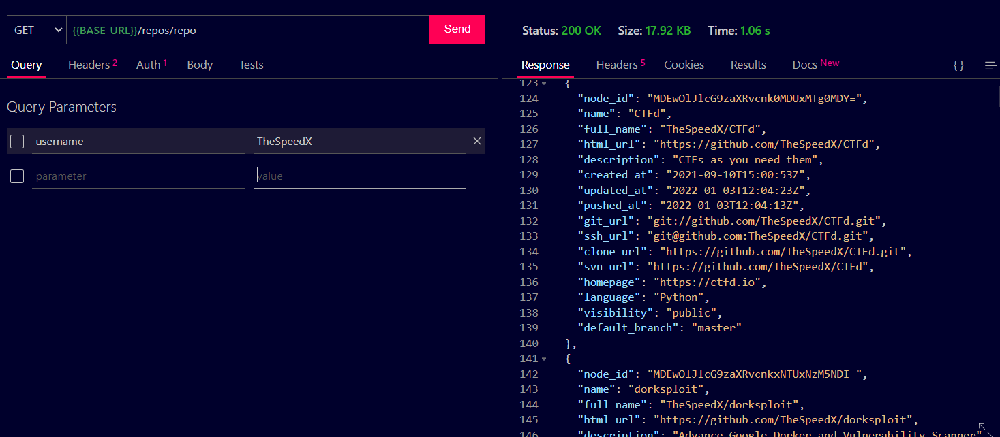

# github_wrapper

This is built using FastAPI in Python.

## How to Run

- ### Initial Setup

First create a `.env` file taking with variables same as in `.example.env`

- Get Your Client ID and Client Secret From Github Application.
- Fill in a Secure Secret Key for Web App to use.

NOTE: While creating your Github Application Fill in callback url as <http://127.0.0.1:8000/github/callback>

- ### Without Docker

Make sure you have Python 3.8+ and pip installed.

Install required dependencies.

```bash
pip install -r requirements.txt
```

Start the Server using `uvicorn`

```bash
uvicorn main:app --host 0.0.0.0 --port 8000
```

Now head over to  <http://127.0.0.1:8000/docs>

- ### With Docker

Make sure you have `docker` and `docker-compose` installed.

Build the container and run it

```bash
docker-compose up --build -d
```

Now head over to  <http://127.0.0.1:8000/docs>

## Screenshots

Head Over To <http://127.0.0.1:8000/github/login> to start OAuth



After Authorization, You will get a JWT Token which you need to pass in all future requests



Now We Can Send Request using the JWT Token as Bearer Token

Here is the [POSTMAN COLLECTION](https://www.getpostman.com/collections/a1cf49a6ecd2ccbd0f55) for the requests.

Some Request Examples are shown below:

Create Repo



List Repo


